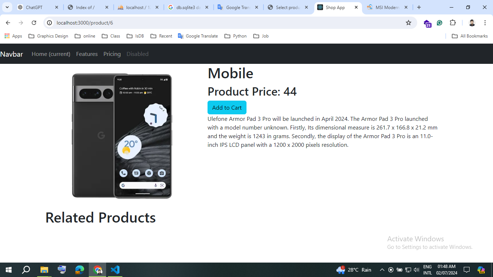
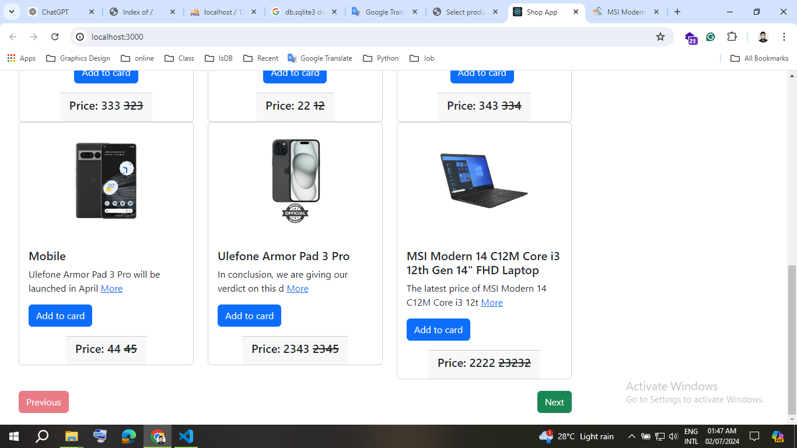

# to start

```
git clone
python -m venv venv
pip install ir requirements.txt
```

```javascript-React
npm i
npm run build

npm start
```

```
python manage.py runserver

```

# Poster-Maker
 Create an E-commerce using python, and Django with react


# Output


---
<h1>Visit Live: https://github.com/tanvirpoly/E-commerce_python_django_react</h1>


---


---


---



---


<!-- all link is here -->


### Contact me:

[E-mail]( tanvirpoly@gmail.com)

[Linkedin]( https://www.linkedin.com/in/tanvirx/)

[Facebook]( https://www.facebook.com/tanvirfbid)


